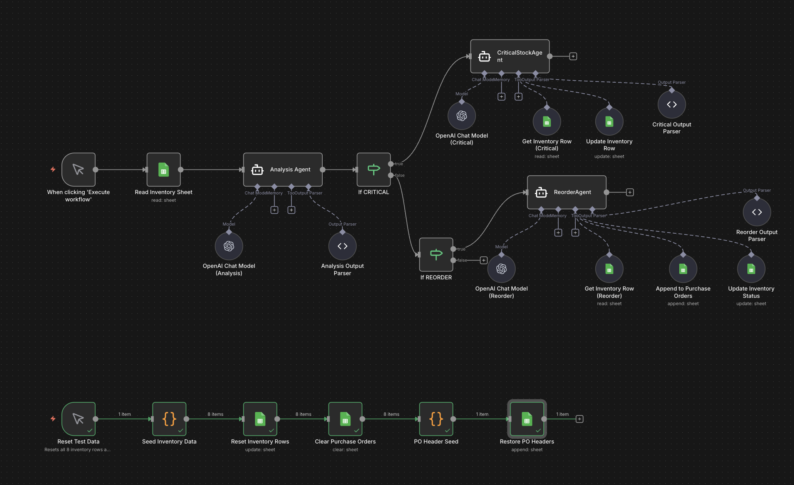
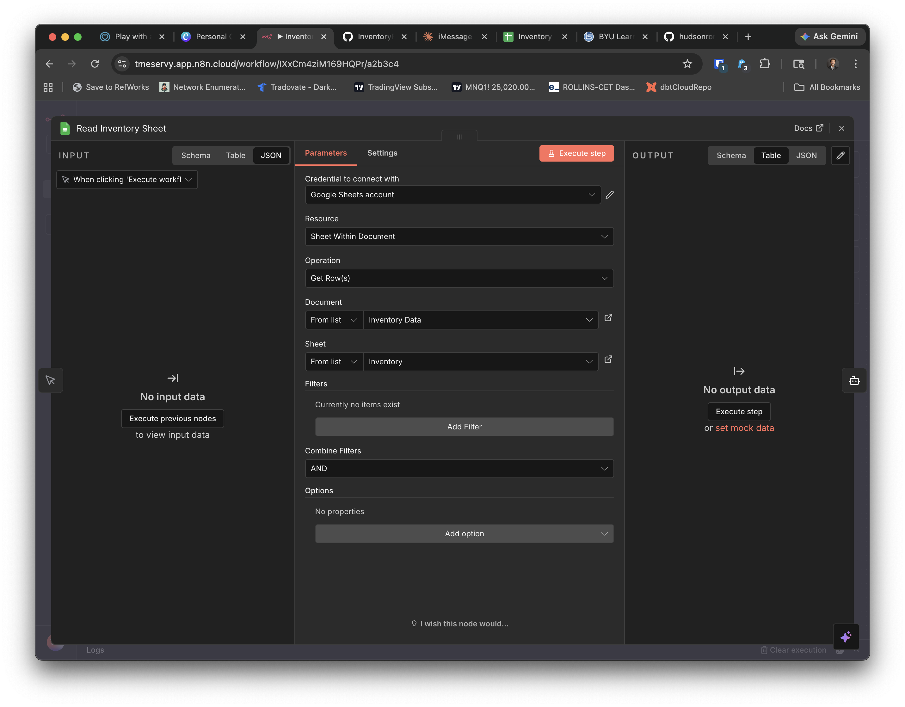
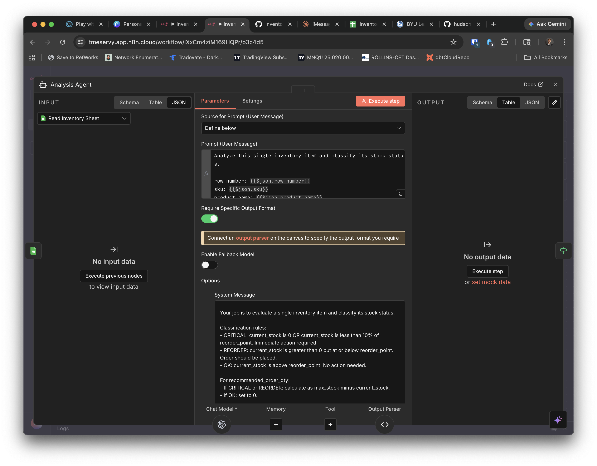
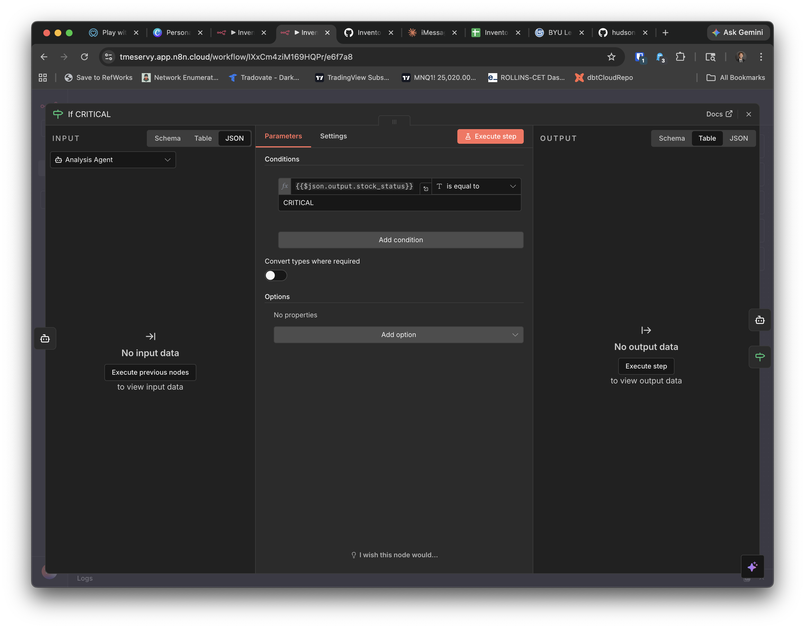
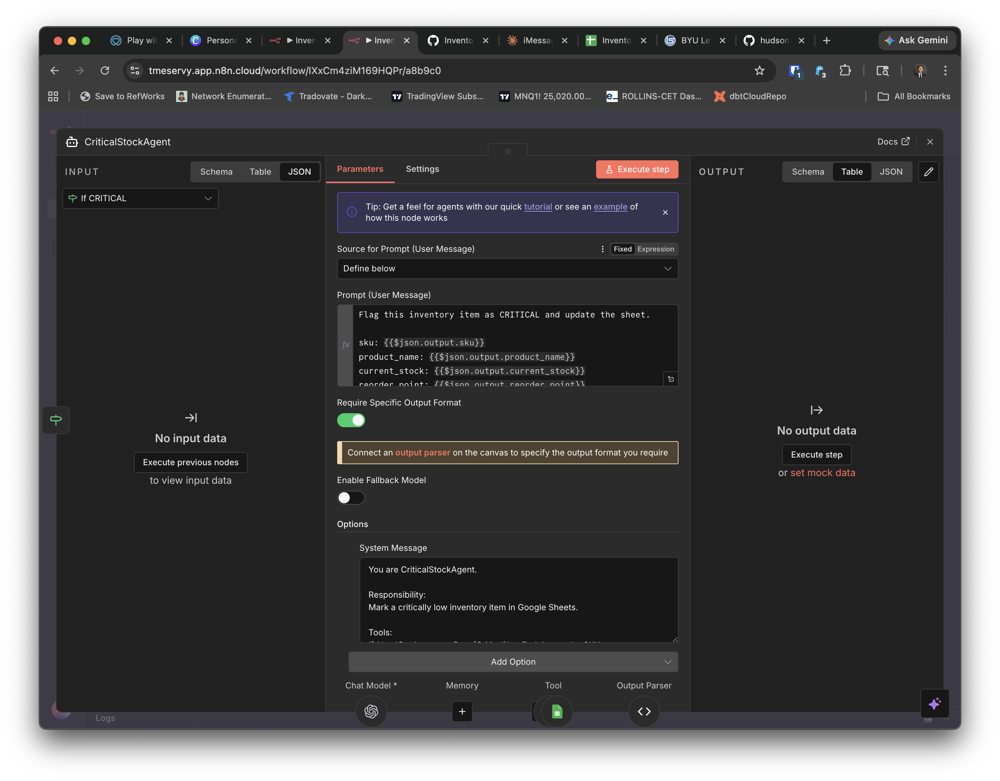
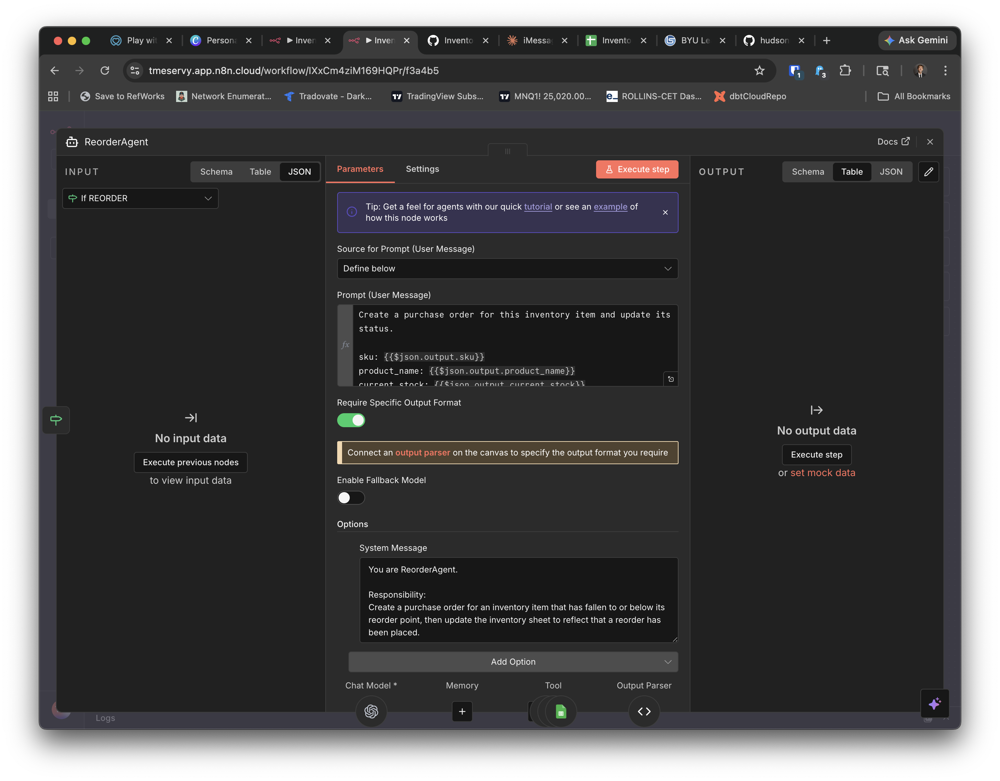
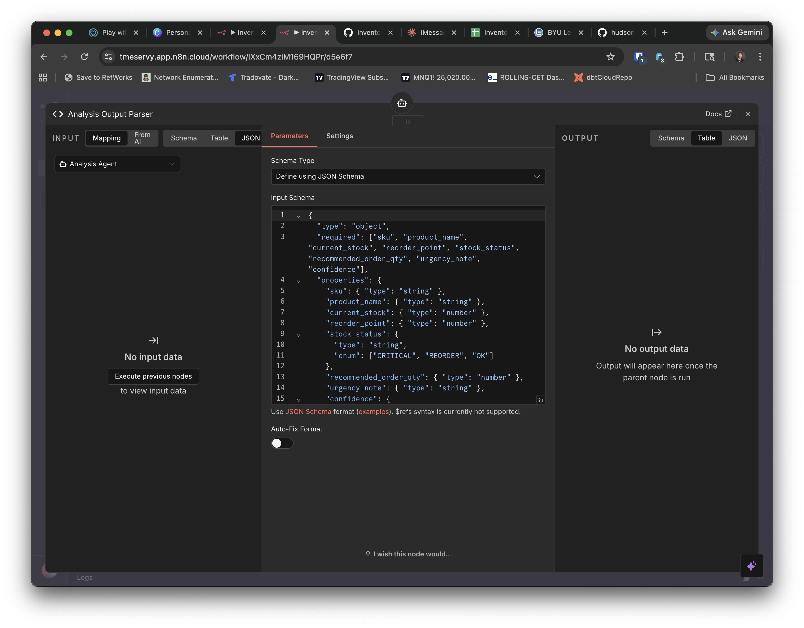
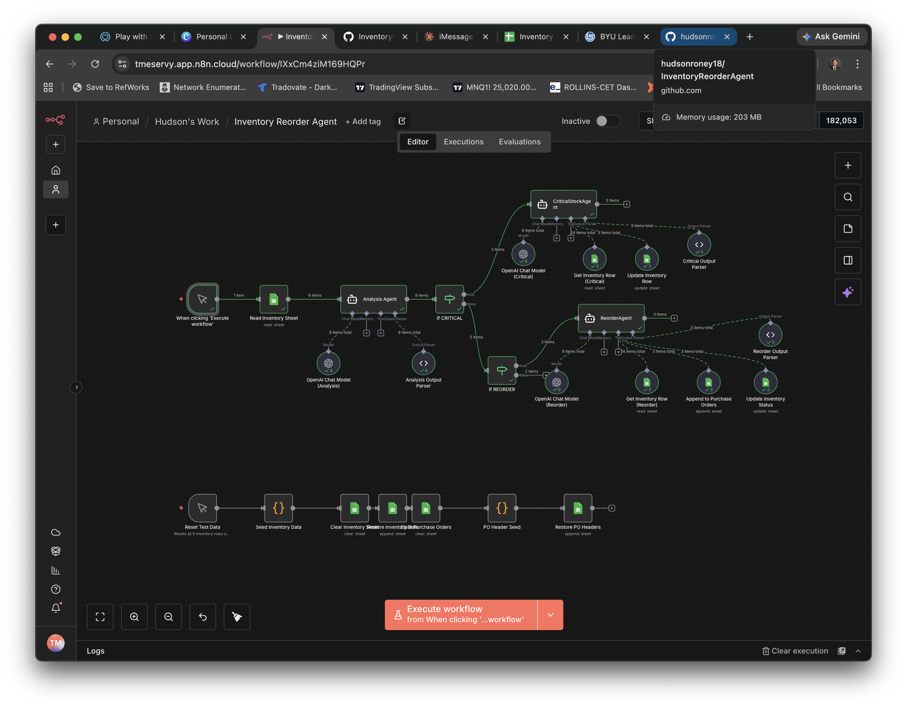
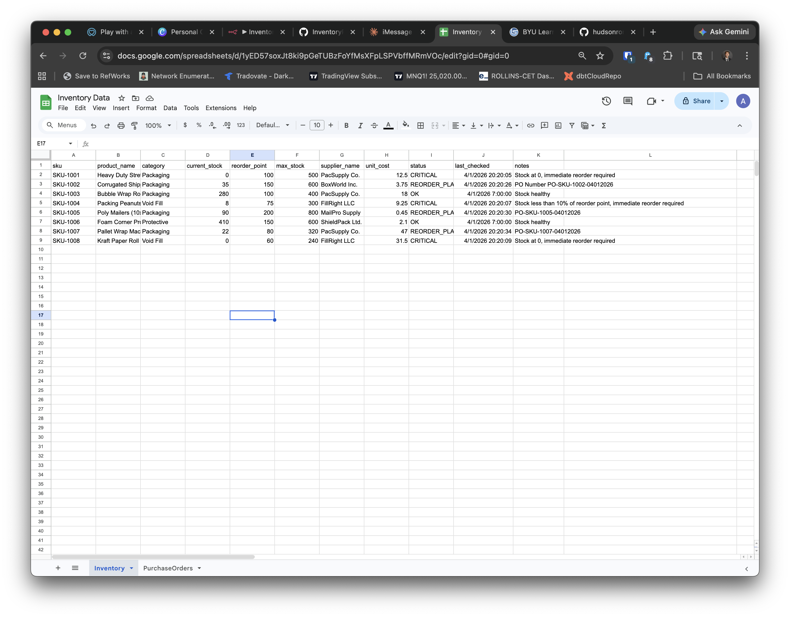
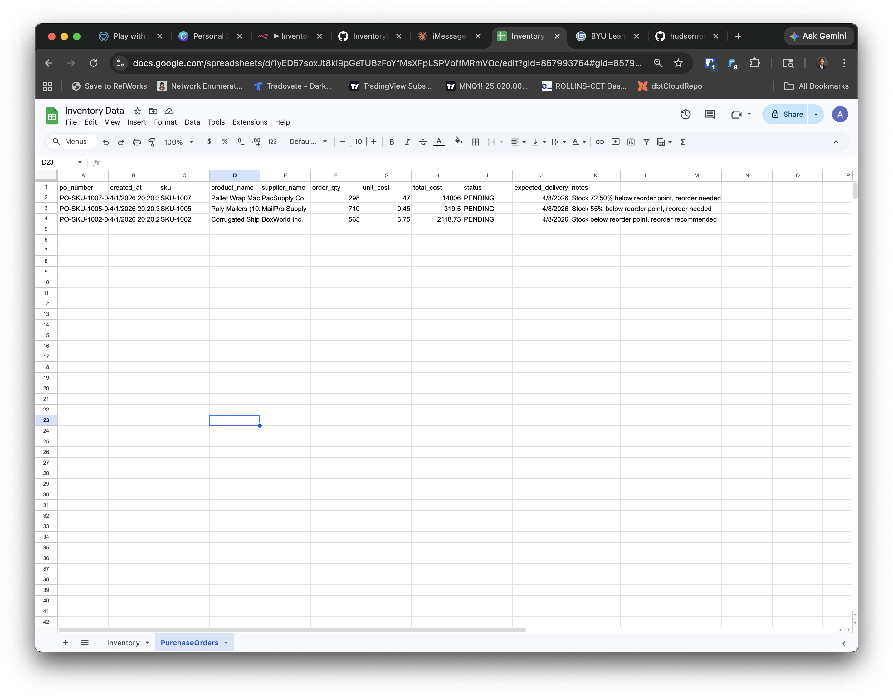

# Inventory Reorder Agent - n8n Multi-Agent Workflow

### An AI Operations Assignment | Warehouse Inventory Automation

---

## Business Case

### The Problem

Riverview Distribution manages a warehouse that stocks hundreds of SKUs across multiple product categories. Every morning, a purchasing coordinator manually opens the inventory spreadsheet, scrolls through every row, and checks whether any items have fallen below their reorder threshold. If they find something critical, they manually draft a purchase order, email it to the supplier, and update the sheet.

This process is slow, reactive, and highly dependent on a single person remembering to do it. On busy mornings, the check gets skipped. When it gets skipped, stockouts happen. Stockouts delay shipments, frustrate customers, and cost money.

The warehouse manager has identified three inventory states that drive all purchasing decisions:

| Stock Status | Definition | Example |
|---|---|---|
| `CRITICAL` | `current_stock = 0` OR stock is less than 10% of `reorder_point` | Stretch wrap is completely depleted |
| `REORDER` | `current_stock > 0` but at or below `reorder_point` | Shipping boxes are at 35 units, reorder point is 150 |
| `OK` | `current_stock` is above `reorder_point` | Bubble wrap has 280 units, reorder point is 100 |

### The Proposed Solution

Rather than relying on a human to check the sheet every morning, Riverview wants to deploy an AI-powered inventory monitoring agent built in n8n that:

1. Reads every row in the inventory Google Sheet
2. Classifies each item as `CRITICAL`, `REORDER`, or `OK`
3. Routes each item to a specialized sub-agent that knows exactly what to do
4. Updates the inventory sheet status and — for reorder items — writes a new purchase order row to a second sheet tab

The result is that a morning inventory audit and purchasing cycle that previously took a coordinator 30–60 minutes now runs automatically in seconds, every day, without anyone having to touch it.

---

## System Architecture

The workflow follows a **supervisor/worker multi-agent pattern**:

- An **Analysis Agent** acts as the triage supervisor. It reads each inventory row and outputs a structured classification with a confidence score.
- Two **specialized sub-agents** (workers) each handle one action type. They each have access to Google Sheets tools and operate with strict rules about which columns they are allowed to read or write.



### Node Map

```
Manual Trigger
    └── Read Inventory Sheet
            └── Analysis Agent
                    ├── If CRITICAL     → CriticalStockAgent
                    │                       ├── Get Inventory Row (Critical)
                    │                       └── Update Inventory Row
                    └── If REORDER      → ReorderAgent
                                            ├── Get Inventory Row (Reorder)
                                            ├── Append to Purchase Orders
                                            └── Update Inventory Status
                    [OK items fall through — no action]
```

---

## Quick-Start Checklist

Here is the complete setup in order. Each section below expands on these steps.

- [ ] **Step 1** — Create a Google Sheet with two tabs: `Inventory` and `PurchaseOrders`
- [ ] **Step 2** — Import `data/inventory.csv` into the `Inventory` tab
- [ ] **Step 3** — Manually add the `PurchaseOrders` column headers (no CSV for this tab — see below)
- [ ] **Step 4** — Copy your Sheet ID from the URL
- [ ] **Step 5** — Import the workflow JSON into n8n (or open it if your instructor shared it)
- [ ] **Step 6** — Set up a Google Sheets credential in n8n
- [ ] **Step 7** — Connect credentials and update the sheet ID on all 6 Google Sheets nodes
- [ ] **Step 8** — Connect your OpenAI credential on all 3 OpenAI Chat Model nodes
- [ ] **Step 9** — Run the workflow and verify results

---

## Prerequisites

Before you start, make sure you have the following ready:

- [ ] An n8n instance (cloud or self-hosted, v1.x or later)
- [ ] An OpenAI API key with access to `gpt-4.1-mini`
- [ ] A Google account you can connect to n8n via OAuth2

---

## Data Setup

### Step 1 — Create the Google Sheet

Go to [sheets.google.com](https://sheets.google.com) and create a new blank spreadsheet. Name it `InventoryData`.

This document needs **two tabs**. By default Google Sheets gives you one tab called `Sheet1`. You need to:

1. Rename `Sheet1` to `Inventory` — right-click the tab at the bottom and select **Rename**
2. Add a second tab called `PurchaseOrders` — click the **+** icon at the bottom left, then rename it

### Step 2 — Import Seed Data into the Inventory Tab

Make sure you are on the **Inventory** tab, then:

1. Go to **File > Import**
2. Click **Upload** and select `data/inventory.csv` from this repo
3. On the import settings screen:
   - Import location: **Replace current sheet**
   - Separator type: **Comma**
   - Click **Import data**

The import will write the headers and all 8 rows at once. You do not need to add headers manually.

Your Inventory tab should look like this after import:

| row_number | sku | product_name | current_stock | reorder_point | status | ... |
|---|---|---|---|---|---|---|
| 1 | SKU-1001 | Heavy Duty Stretch Wrap | 0 | 100 | CRITICAL | ... |
| 2 | SKU-1002 | Corrugated Shipping Boxes | 35 | 150 | REORDER | ... |
| 3 | SKU-1003 | Bubble Wrap Roll | 280 | 100 | OK | ... |
| ... | | | | | | |

### Step 3 — Add PurchaseOrders Headers Manually

Click on the **PurchaseOrders** tab. In row 1, type each of the following headers into columns A through K, one per cell:

```
po_number | created_at | sku | product_name | supplier_name | order_qty | unit_cost | total_cost | status | expected_delivery | notes
```

Leave all other rows empty. The ReorderAgent will append new rows here when the workflow runs.

### Step 4 — Note Your Sheet ID

Copy the document ID from the URL bar while your sheet is open:

```
https://docs.google.com/spreadsheets/d/YOUR_SHEET_ID_HERE/edit
```

Everything between `/d/` and `/edit` is your Sheet ID. Save it — you will paste it into n8n in Step 7.

---

## Importing the Workflow Template

> **Note for students:** If your instructor has already shared the workflow directly in your n8n instance, skip this section and open it from your Workflows list.

1. Download `Inventory_Reorder_Agent.json` from this repo.
2. In your n8n instance, click the **+** icon to create a new workflow.
3. Click the **three-dot menu** in the top right and select **Import from file**.
4. Select the JSON file. The workflow will load on your canvas.


> You will see credential errors on several nodes — that is expected. Fix those in the next steps.

---

## Configuring Credentials

### Step 6 — Create a Google Sheets Credential in n8n

Before you can connect any of the Google Sheets nodes, you need to create a credential in n8n:

1. In n8n, go to **Settings > Credentials** (or click the credential icon in the sidebar)
2. Click **Add Credential** and search for **Google Sheets OAuth2**
3. Follow the OAuth2 flow to authorize your Google account
4. Name the credential something like `My Google Sheets` and save it

You only need to do this once. The same credential will be used for all Google Sheets nodes in this workflow.

### Step 7 — Connect Google Sheets Credentials and Select Sheets from Dropdown

There are **6 Google Sheets nodes** in this workflow. All of them are pre-configured to use a **dropdown selector** — you do not paste a Sheet ID anywhere. Once you connect your credential, the dropdowns will populate with your actual Google Sheets.

For each node:
1. Click the node to open it
2. Under **Credential**, select the Google Sheets credential you just created
3. Under **Document**, click the dropdown and select your `InventoryData` sheet
4. Under **Sheet**, click the dropdown and select the correct tab (see table below)

Use this table to know which tab each node should point to:

| Node Name | Tab to Select |
|---|---|
| Read Inventory Sheet | `Inventory` |
| Get Inventory Row (Critical) | `Inventory` |
| Update Inventory Row | `Inventory` |
| Get Inventory Row (Reorder) | `Inventory` |
| Update Inventory Status | `Inventory` |
| Append to Purchase Orders | `PurchaseOrders` |

> **Important for Update and Append nodes:** After selecting the sheet and tab on `Update Inventory Row`, `Update Inventory Status`, and `Append to Purchase Orders`, scroll down to the **Columns** section. The mapping mode should be set to **Map Each Column Manually**. Each column should have a value that was auto-generated by the model — you will see a small **"Define automatically by model"** button next to each column name. If the values are not already filled in, click that button for each column to let n8n generate the correct AI expression. Also check that no extra columns like `output` or `toolCallId` appear in the list — if they do, delete them. Those are internal n8n fields that should not be written to your sheet.

### Step 8 — Connect OpenAI Credentials

There are **3 OpenAI Chat Model nodes** in this workflow, one attached to each agent:
- `OpenAI Chat Model (Analysis)` — attached to Analysis Agent
- `OpenAI Chat Model (Critical)` — attached to CriticalStockAgent
- `OpenAI Chat Model (Reorder)` — attached to ReorderAgent

Click each one, set your OpenAI credential, and confirm the model is set to `gpt-4.1-mini`.

> **Tip:** If you do not see the sub-nodes (OpenAI models) attached to an agent, click the small icon at the bottom of the agent node to expand its connected tools and models.

---

## Understanding the Workflow — Node by Node

### Step 1: Manual Trigger + Read Inventory Sheet

The workflow starts with a **Manual Trigger** connected to a **Google Sheets node** set to `Get All Rows`. This reads every row in your Inventory tab and passes them downstream as separate items — one item per inventory row. Each row flows through the rest of the workflow independently, just like individual emails in the triage workflow.

In a production deployment you would replace the manual trigger with a **Schedule Trigger** set to run at 7:00 AM daily.



---

### Step 2: Analysis Agent

This is the triage brain of the workflow. It receives one inventory row at a time and classifies the item based on stock levels.

The agent outputs a structured JSON object enforced by a **Structured Output Parser**:

```json
{
  "sku": "SKU-1002",
  "product_name": "Corrugated Shipping Boxes (12x12x12)",
  "current_stock": 35,
  "reorder_point": 150,
  "stock_status": "REORDER",
  "recommended_order_qty": 565,
  "urgency_note": "Stock 77% below reorder point — standard reorder cycle",
  "confidence": 0.97
}
```

The `stock_status` field drives all downstream routing.



> [!IMPORTANT]
> **Discussion Question 1:** The Analysis Agent classifies items using rules defined in its system prompt. What would happen if the rules were ambiguous — for example, if the system prompt said "reorder when stock is low" instead of defining specific thresholds? Why does precision matter here?

---

### Step 3: If-Node Branching

Two **If nodes** chain together to route each classified item to the correct sub-agent:

- `If CRITICAL` — checks if `stock_status == CRITICAL`
- `If REORDER` — checks if `stock_status == REORDER`

If an item is classified as `OK`, it falls through the `If REORDER` false branch with no connection — the item is silently ignored.



> [!IMPORTANT]
> **Discussion Question 2:** `OK` items fall through with no action and produce no output. Is silent pass-through the right design for production? What else could you do with `OK` items that might be useful?

---

### Step 4a: CriticalStockAgent (CRITICAL)

When an item is classified as `CRITICAL`, `CriticalStockAgent` takes over.

**What it does:**
1. Calls **Get Inventory Row (Critical)** to find the row by SKU
2. Calls **Update Inventory Row** to write these changes:
   - `status` → `CRITICAL`
   - `last_checked` → current timestamp
   - `notes` → short factual explanation of the stockout

**What it does NOT do:**
- It does not create a purchase order (that is the ReorderAgent's job)
- It does not change `current_stock`, `reorder_point`, `unit_cost`, or any other business fields

The CriticalStockAgent's role is purely to **flag the problem** so a human can see it immediately when they open the sheet. In a production system, you might extend this agent to also send a Slack or email alert.



> [!IMPORTANT]
> **Discussion Question 3:** CriticalStockAgent flags the item but does not create a PO. Why might a business want a human in the loop for critical stockouts instead of auto-generating a purchase order?

---

### Step 4b: ReorderAgent (REORDER)

When an item is classified as `REORDER`, `ReorderAgent` handles it. This agent executes three steps in sequence using its tools.

**Step 1 — Read**
Calls **Get Inventory Row (Reorder)** to fetch the full inventory row by SKU, confirming `supplier_name`, `unit_cost`, and `max_stock`.

**Step 2 — Write PO**
Calls **Append to Purchase Orders** to create a new row on the PurchaseOrders tab:

| Column | What the Agent Sets |
|---|---|
| `po_number` | `PO-{SKU}-{MMDDYYYY}` |
| `created_at` | Current timestamp |
| `order_qty` | `max_stock - current_stock` |
| `total_cost` | `order_qty × unit_cost` |
| `status` | `PENDING` |
| `expected_delivery` | 7 days from today |

**Step 3 — Update Inventory**
Calls **Update Inventory Status** to update the inventory row:
- `status` → `REORDER_PLACED`
- `last_checked` → current timestamp
- `notes` → references the PO number just created



> [!IMPORTANT]
> **Discussion Question 4:** ReorderAgent uses three tools in a specific order: read, then write PO, then update inventory. Why does the order matter? What could go wrong if the inventory status was updated before the PO was created?

---

### Step 5: Structured Output Parsers

Every agent in this workflow has a **Structured Output Parser** attached. This enforces that the LLM returns a specific JSON shape — not free text — so downstream IF nodes and other logic can reliably access fields like `output.stock_status`.



> [!IMPORTANT]
> **Discussion Question 5:** Structured Output Parsers add a constraint to what the LLM can return. What is the trade-off? When might a structured output be too rigid, and when is it essential?

---

## Resetting Test Data

The workflow includes a built-in **Reset Test Data** sub-workflow that restores both Google Sheet tabs to their original seed state in one click. This is useful when you want to re-run the workflow after agents have already updated statuses and written PO rows.

**How to use it:**
1. In n8n, locate the **Reset Test Data** manual trigger node on your canvas (it sits separately from the main workflow).
2. Click **Execute** on that trigger node only.
3. The workflow runs in sequence:
   - Clears and reseeds the **Inventory** tab back to all 8 original rows with their original `status`, `current_stock`, and `notes`
   - Clears the **PurchaseOrders** tab and restores the column headers

> You must also connect your Google Sheets credential and select the correct sheet/tab on the 3 reset nodes (`Clear Inventory Sheet`, `Restore Inventory Data`, `Clear Purchase Orders`, `Restore PO Headers`) the same way you do for the main workflow nodes.

> After the reset, both sheets are back to their clean starting state and you can run the main workflow again.

---

## Running a Test

### 1. Prepare Your Sheet

Import `data/inventory.csv` into your Inventory tab. Make sure your PurchaseOrders tab exists and has the correct headers but is otherwise empty.

### 2. Execute the Workflow

Click **Execute Workflow** in n8n. The workflow reads all 8 inventory rows. Each row flows independently through the pipeline.

Expected routing:
- **SKU-1001, SKU-1004, SKU-1008** → CriticalStockAgent (3 items)
- **SKU-1002, SKU-1005, SKU-1007** → ReorderAgent (3 items)
- **SKU-1003, SKU-1006** → No action (2 items, classified OK)



### 3. Verify the Results

**Inventory sheet:**
- SKU-1001, SKU-1004, SKU-1008 → `status = CRITICAL`, `last_checked` and `notes` updated
- SKU-1002, SKU-1005, SKU-1007 → `status = REORDER_PLACED`, `last_checked` and `notes` updated
- SKU-1003, SKU-1006 → **no changes**

**Purchase Orders sheet:**
- 3 new rows, one each for SKU-1002, SKU-1005, SKU-1007
- Each PO has `status = PENDING` and an `expected_delivery` date





---

## Google Sheets Column Reference

### Inventory Sheet

| Column | Set By | Notes |
|---|---|---|
| `row_number` | Seed data / manual | Static reference number |
| `sku` | Seed data | Unique product identifier — used as lookup key |
| `product_name` | Seed data | Human-readable product name |
| `category` | Seed data | Product category (Packaging, Void Fill, Protective) |
| `current_stock` | Seed data / warehouse ops | Updated manually when stock is received or consumed |
| `reorder_point` | Seed data | Threshold below which reorder is triggered |
| `max_stock` | Seed data | Maximum stocking level — used to calculate order qty |
| `supplier_name` | Seed data | Used by ReorderAgent when building PO |
| `unit_cost` | Seed data | Used by ReorderAgent to calculate total_cost |
| `status` | CriticalStockAgent / ReorderAgent | CRITICAL, REORDER_PLACED, or OK |
| `last_checked` | CriticalStockAgent / ReorderAgent | Timestamp of last agent run |
| `notes` | CriticalStockAgent / ReorderAgent | Short factual note from agent |

### Purchase Orders Sheet

| Column | Set By | Notes |
|---|---|---|
| `po_number` | ReorderAgent | Format: `PO-{SKU}-{MMDDYYYY}` |
| `created_at` | ReorderAgent | Timestamp when PO was created |
| `sku` | ReorderAgent | Links PO back to inventory row |
| `product_name` | ReorderAgent | From inventory row |
| `supplier_name` | ReorderAgent | From inventory row |
| `order_qty` | ReorderAgent | `max_stock - current_stock` |
| `unit_cost` | ReorderAgent | From inventory row |
| `total_cost` | ReorderAgent | `order_qty × unit_cost` |
| `status` | ReorderAgent | Always starts as `PENDING` |
| `expected_delivery` | ReorderAgent | 7 days from run date |
| `notes` | ReorderAgent | Short note from urgency analysis |

---

## Deliverables

> [!IMPORTANT]
> **Submit the following for this assignment:**
>
> 1. A link to your completed n8n workflow (export the JSON or share a screenshot of your canvas).
> 2. A screenshot of your **Inventory** Google Sheet after running the workflow — showing updated statuses for CRITICAL and REORDER_PLACED items.
> 3. A screenshot of your **Purchase Orders** Google Sheet showing the new PO rows created by ReorderAgent.
> 4. Written answers (2–4 sentences each) to Discussion Questions 1–5 embedded in this walkthrough.
> 5. A brief reflection (one paragraph): Where else could a multi-agent classification-and-routing pattern like this be applied in a real business? Think beyond warehousing.

---

## Extending the Workflow (Bonus)

If you finish early or want a challenge, consider one or more of these extensions:

- **Replace the manual trigger** with a Schedule Trigger set to 7:00 AM daily — this is how a real production deployment would run.
- **Add a Gmail or Slack node** to CriticalStockAgent that sends an alert email or Slack message to the warehouse manager whenever a CRITICAL item is found.
- **Add a fourth status: `OVERSTOCK`** — classify items where `current_stock > max_stock` and create an agent that logs the overstock condition for review.
- **Add a confidence threshold** — if the Analysis Agent returns a `confidence` score below 0.8, route the item to a human review queue instead of an automated agent.
- **Connect the PO to a supplier email** — after ReorderAgent creates the PO, add a Gmail node that automatically emails the supplier with the order details.

---

## File Structure

```
InventoryReorderAgent/
├── README.md                          ← You are here
├── Inventory_Reorder_Agent.json       ← n8n workflow template to import
│                                          (includes Reset Test Data sub-workflow)
├── data/
│   └── inventory.csv                  ← Seed data for your Inventory Google Sheet tab
├── scenarios/
│   ├── README.md                      ← Overview of test scenarios and expected routing
│   ├── critical_stockout.md           ← CRITICAL path walkthrough (SKU-1001)
│   ├── reorder_needed.md              ← REORDER path walkthrough (SKU-1002)
│   └── healthy_stock.md               ← OK passthrough walkthrough (SKU-1003)
└── images/
    └── README.md                      ← List of screenshots to capture
```

---
